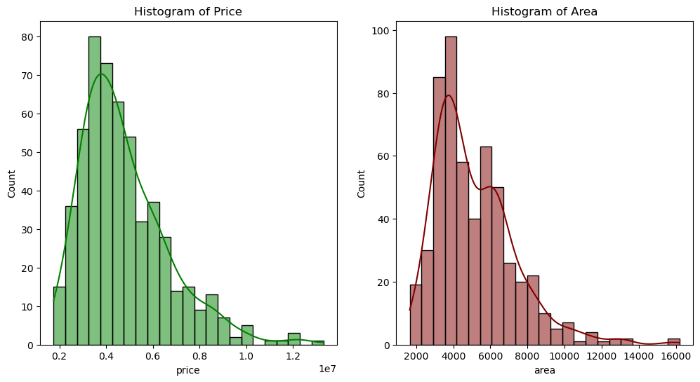
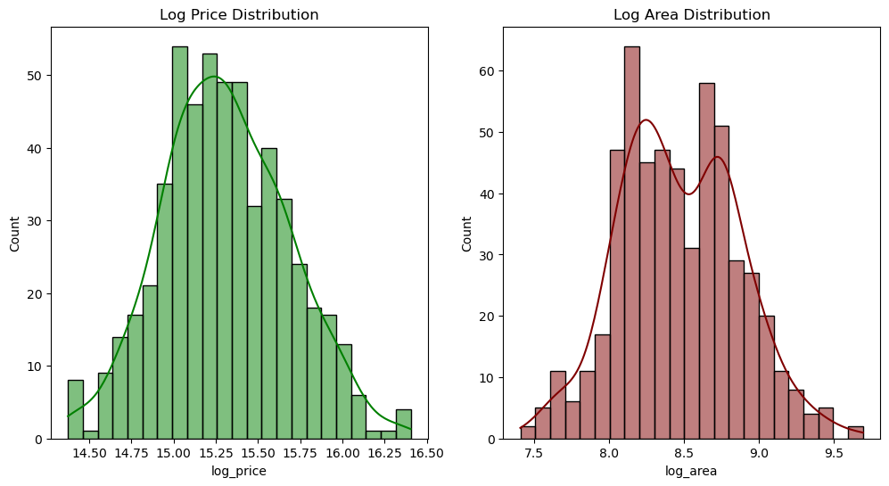
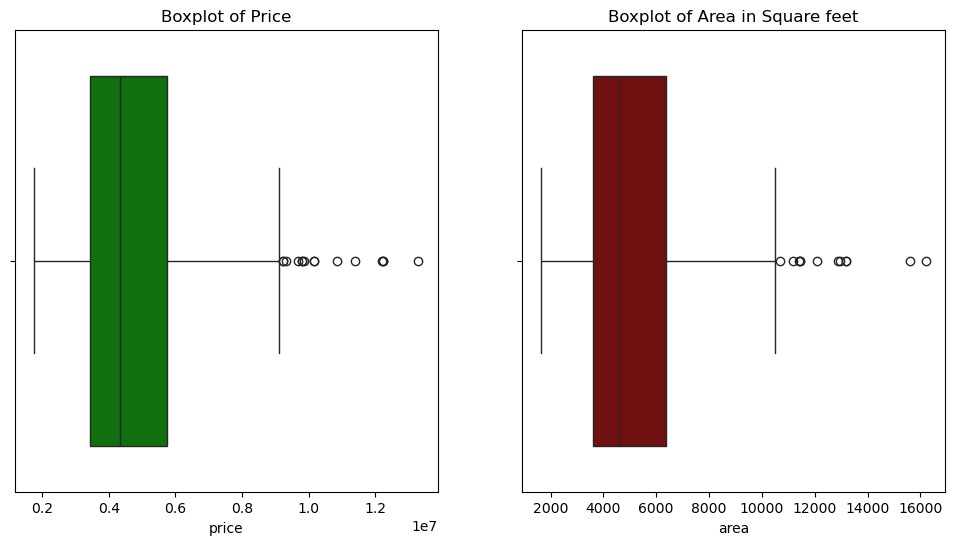
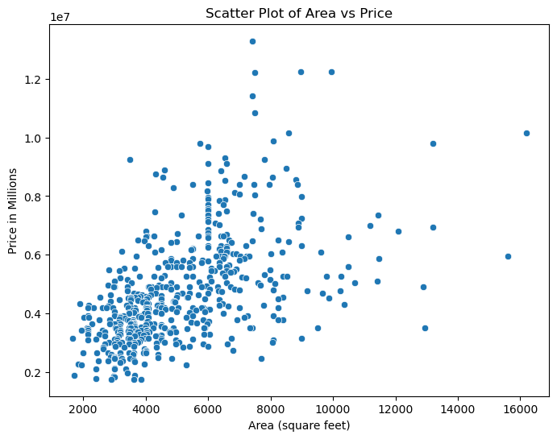
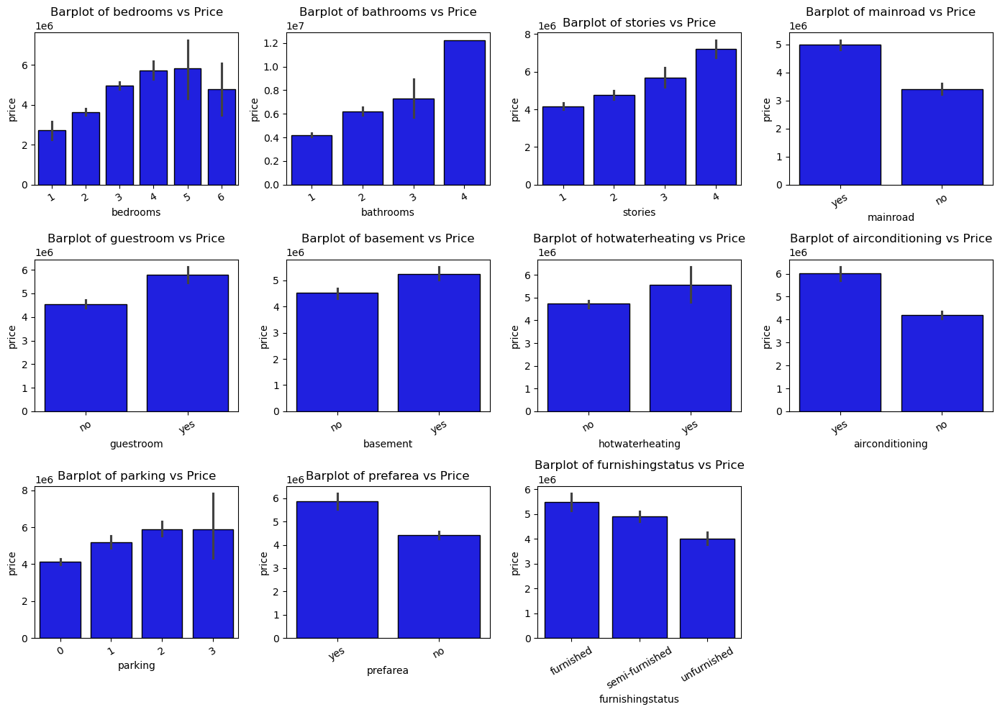
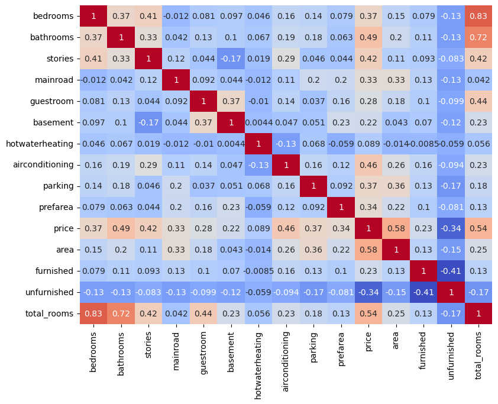
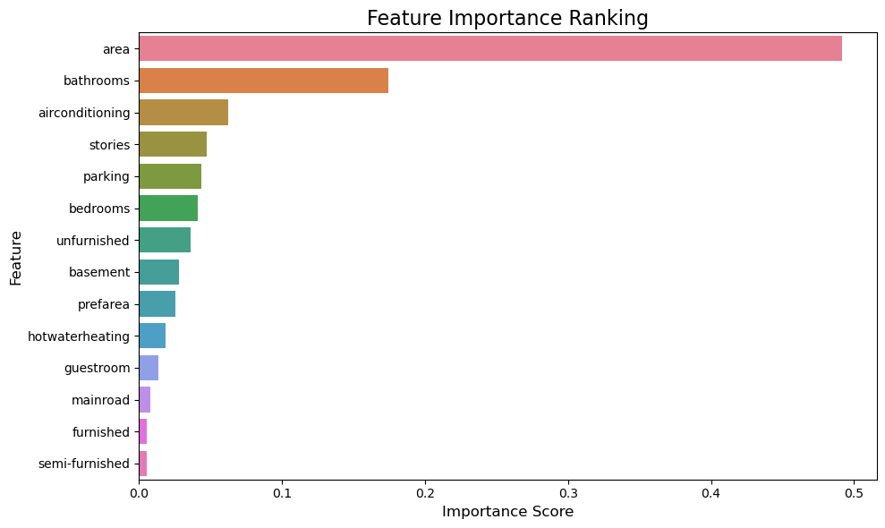

# Housing Price Prediction Project
## Objective:
The goal of this project was to predict house prices accurately using various regression models and feature engineering techniques. This project demonstrates a detailed approach to model development, evaluation, and improvement.
## Problem Statement:
House prices depend on numerous factors such as property size, location, and amenities. Predicting these prices accurately is crucial for stakeholders in the real estate sector. This project aims to explore the relationships among these features, develop robust models, and identify the best-performing one
## Dataset Overview:
The dataset contains the following variables:
1.Price: The target variable representing the price of the house (continuous variable).
2.Area: The size of the property in square feet.
3.Bedrooms: The number of bedrooms in the house.
4.Bathrooms: The number of bathrooms in the house.
5.Stories: The number of floors/stories in the house.
6.Mainroad: Whether the house is near the main road (categorical: Yes/No).
7.Guestroom: Whether the house has a guestroom (categorical: Yes/No).
8.Basement: Whether the house has a basement (categorical: Yes/No).
9.Hot Water Heating: Whether the house has hot water heating (categorical: Yes/No).
10.Airconditioning: Whether the house has air conditioning (categorical: Yes/No).
11.Parking: The number of parking spaces available.
12.Prefarea: Whether the house is located in a preferred area (categorical: Yes/No).
13.Furnishing Status: Indicates if the house is furnished (categories: Furnished, Semi-furnished, or Unfurnished). 
Steps Taken: 
### 1.Exploratory Data Analysis (EDA):
- Uni-variate Analysis:
- Performed analysis for all variables and visualised their distributions.
- Below are the histograms of the continuous numerical variables before and after log transformations.

We can see the changes in the spread of the data after the log transformations. Though it is not a perfectly normal distribution but the transformation helped center the data and make it more symmetric.

- Outlier Detection:
	- Identified outliers using boxplots.

We can observe outliers, such as homes priced over 9 million and those with square footage larger than 8,000 square feet. Additionally, there is a significant jump in the outliers from 14,000 to 16,000 square feet.

-Bi-variate Analysis:
-Scatterplot to study the relationship between Area and Price.

- Categorical Variable Analysis: Visualised relationships between categorical variables and Price using barplots.

  

- Multivariate Analysis:
- Correlation heatmap to identify key relationships among variables.

2.Feature Engineering:
a)Created a new feature Total Rooms by combining bedrooms, bathrooms, and guestroom.
b)Updated the correlation heatmap to reflect the new feature.
c)Heatmap including the Total Rooms feature.	

### 3.Data Preprocessing:
a)  Converted categorical variables to numerical using .map() and created dummy variables.
b)  Scaled selected numerical features for model training.

### 4.Model Development and Evaluation: 
a)Baseline Model: Trained a Linear Regression model and evaluated it using R² and MSE.
b)Improvement:
i.  Applied Polynomial Features and Ridge Regression, tuned using GridSearchCV with cross-validation.
ii.  Undid log transformations and trained new models with and without transformations using all features.
c)Random Forest Regressor:
i.Trained a baseline model without transformations or scaling.
ii.Performed hyperparameter tuning with GridSearchCV.
iii.Removed the three least important features and retrained the model.
iv.Built a Random Forest model with log transformations and polynomial features.
v.Barplot of feature importances from Random Forest models is shown below:

### 5.Model Comparison: Compared the performance of all models using a summary table created in Jupyter Notebook to highlight R² and MSE values.

Technologies and Tools Used:
- Programming Language: Python.
- Libraries: Pandas, NumPy, Seaborn, Matplotlib, Scikit-learn.
- Environment: Jupyter Notebook.
Key Insights and Results: 
- Area was consistently identified as the most influential feature for predicting Price.
- Feature engineering and log transformations significantly improved model performance.
- Random Forest models generally performed well but required extensive tuning to match Ridge Regression results. 
Final Verdict:
The best-performing model was Ridge Regression with GridSearchCV, log transformations, and polynomial features. This model achieved the lowest test MSE (0.062) and the highest R² (0.679), making it the most reliable predictor of housing prices in this analysis. 
Next Steps:
This project highlights the importance of feature transformations and hyperparameter tuning in regression tasks. Future work could explore:
1.Testing advanced algorithms like Gradient Boosting or XGBoost.
2.Using additional feature engineering techniques to improve predictions.

